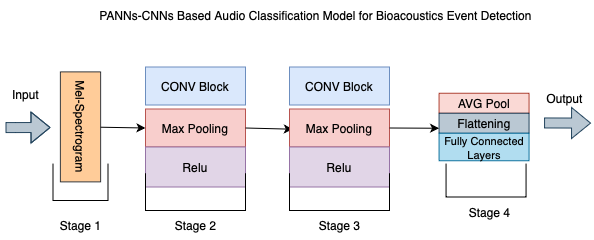

# DCASE-2024-Bioacoustics
Participation for the DCASE Challenge
We participated in the DCASE challnge by implementing twio unique approaches.
Implementing two Machine Learning Models integrated with Few-Shot Learning techniques:
Pretrained Audio Neural Networks based on Convoloutional Neural Networks,and Residual Networks based on Convoloutional Neural Networks.
our Feature Extraction relied on extracting Mel spectrograms, and using features such as Normalaisation ,Adaptation and Data Augmentation Techniques.
we tested our Model's performance om the Test set provided by the DCASE challenge achieving promising results

## Bioacoustics Event Detection Models

### PANNs Model Architecture

### ResNet-CNNs Model Architecture

### Evaluation Performance

| Model  | Precision | Recall  | F1     |
|--------|-----------|---------|--------|
| PANNs  | 1.0       | 0.4918  | 0.6593 |
| ResNet | 1.0       | 0.4407  | 0.6110 |
