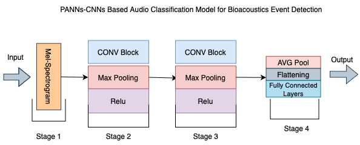
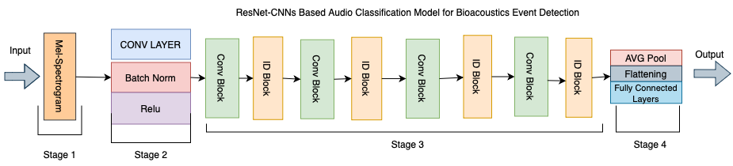

# DCASE-2024-Bioacoustics

## Overview
This repository contains our solution for the **DCASE 2024 Challenge – Task 5: Bioacoustics Event Detection**, which focuses on detecting and classifying animal sound events in real-world acoustic environments.

Bioacoustic event detection is a challenging problem due to:
- High background noise
- Overlapping sound events
- Limited labeled data
- Large variability in animal vocalizations

To address these challenges, we explored **deep learning–based audio classification approaches** and evaluated how **pretrained vs. custom CNN architectures** perform under few-shot and low-resource conditions.

---

## Project Objectives
- Detect and classify animal sound events from environmental audio recordings  
- Build robust models capable of generalizing to unseen acoustic conditions  
- Compare the effectiveness of **Pretrained Audio Neural Networks (PANNs)** and **Residual CNN architectures (ResNet-CNNs)**  
- Evaluate performance using the official **DCASE evaluation protocol**

---

## Feature Extraction & Audio Preprocessing
Raw audio signals were transformed into **Mel-spectrogram representations**, which provide a compact time–frequency representation aligned with human auditory perception and widely used in audio classification tasks.

### Preprocessing steps:
- Conversion of raw audio waveforms to Mel-spectrograms
- Feature normalization to stabilize training
- Data adaptation techniques to improve robustness across recording conditions
- Data augmentation to reduce overfitting and improve generalization

These steps were critical for handling environmental noise and variability present in real-world bioacoustic datasets.

---

## Bioacoustics Event Detection Models
We implemented and evaluated two CNN-based architectures, each with different design philosophies.

---

### PANNs Model Architecture
The PANNs-based model leverages **pretrained convolutional layers** trained on large-scale audio datasets. These pretrained representations capture general audio patterns that transfer well to bioacoustic tasks, especially when labeled data is limited.

**Architecture characteristics:**
- Input: Mel-spectrogram
- Stacked convolutional blocks with ReLU activation
- Max pooling for temporal and frequency downsampling
- Global average pooling to aggregate temporal information
- Fully connected layers for final classification

---

### ResNet-CNNs Model Architecture
The ResNet-based architecture introduces **residual (skip) connections**, allowing the network to learn deeper representations while mitigating vanishing gradient issues.

**Architecture characteristics:**
- Input: Mel-spectrogram
- Initial convolution with batch normalization and ReLU activation
- Multiple convolutional and identity residual blocks
- Improved gradient flow through skip connections
- Global average pooling followed by fully connected layers

---

## Training Strategy
- Models were trained using supervised learning on the DCASE training dataset
- Few-shot learning principles were applied to improve performance under limited data conditions
- Optimization focused on balancing precision and recall for bioacoustic event detection
- Hyperparameters were tuned to prevent overfitting while maintaining strong generalization

---

## Evaluation & Results
Model performance was evaluated on the **official DCASE test set**, using Precision, Recall, and F1-score as evaluation metrics.

| Model  | Precision | Recall  | F1-Score |
|--------|-----------|---------|----------|
| PANNs  | 1.00      | 0.4918  | **0.6593** |
| ResNet | 1.00      | 0.4407  | 0.6110   |

### Analysis
- Both models achieved perfect precision, indicating strong confidence in detected events
- The PANNs model achieved higher recall and F1-score, suggesting better generalization
- Results highlight the advantage of pretrained audio representations for bioacoustic event detection in low-resource scenarios

---

## Tools & Technologies
- **Python**
- **PyTorch**
- **Librosa**
- **CNNs, ResNet, PANNs**
- **Few-Shot Learning techniques**

---

## Conclusion
This project demonstrates an end-to-end deep learning pipeline for bioacoustics event detection, from audio preprocessing to model evaluation. Our findings show that **pretrained audio models (PANNs)** can outperform deeper custom CNN architectures when labeled data is limited, making them particularly well-suited for real-world bioacoustic monitoring applications.

The repository showcases practical experience in:
- Audio signal processing
- Deep learning model design
- Transfer learning and few-shot learning
- Evaluation under real-world constraints
